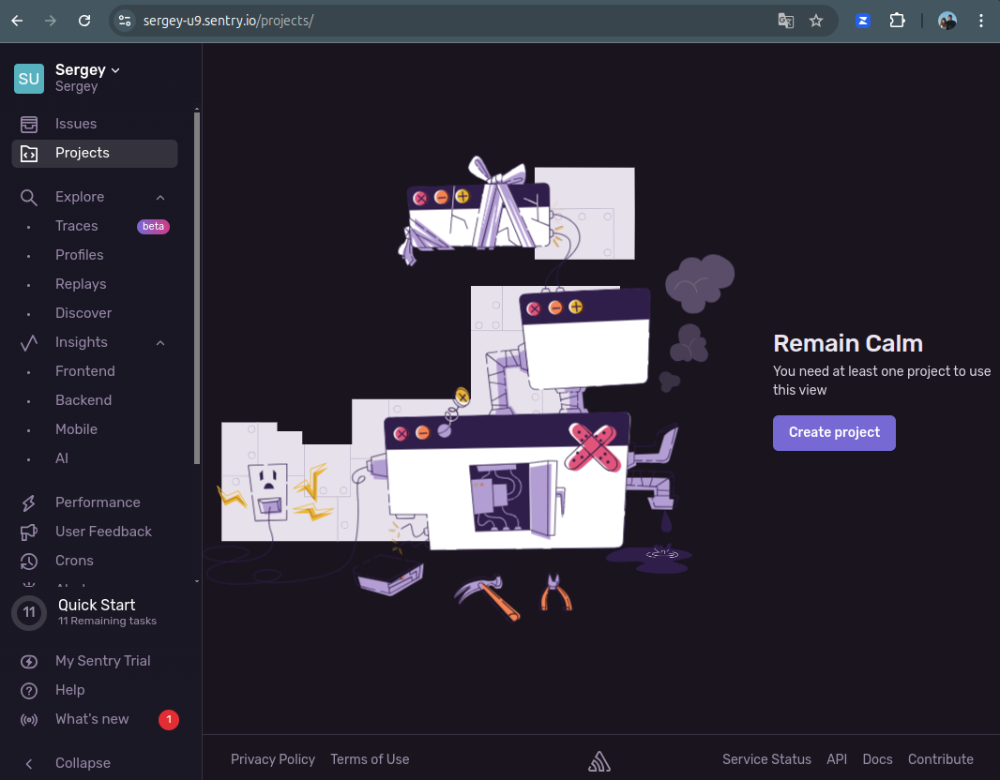
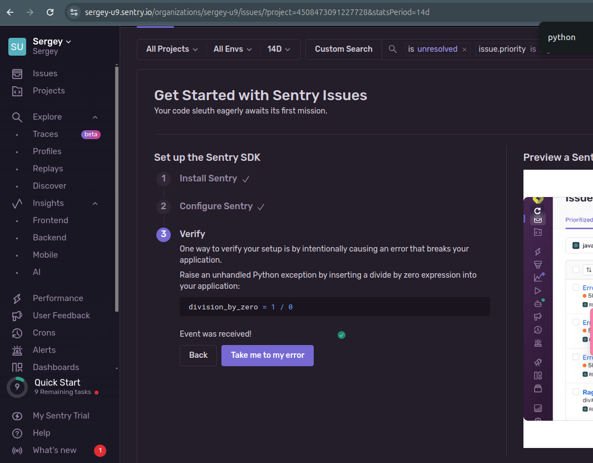
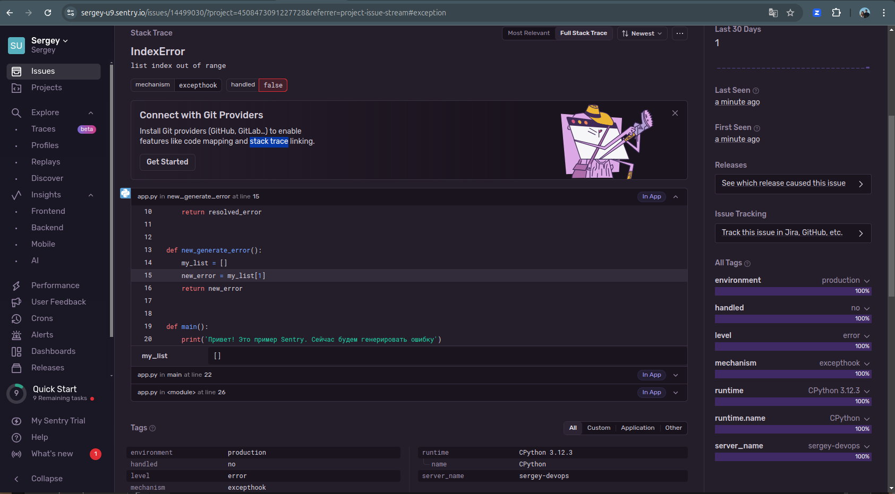
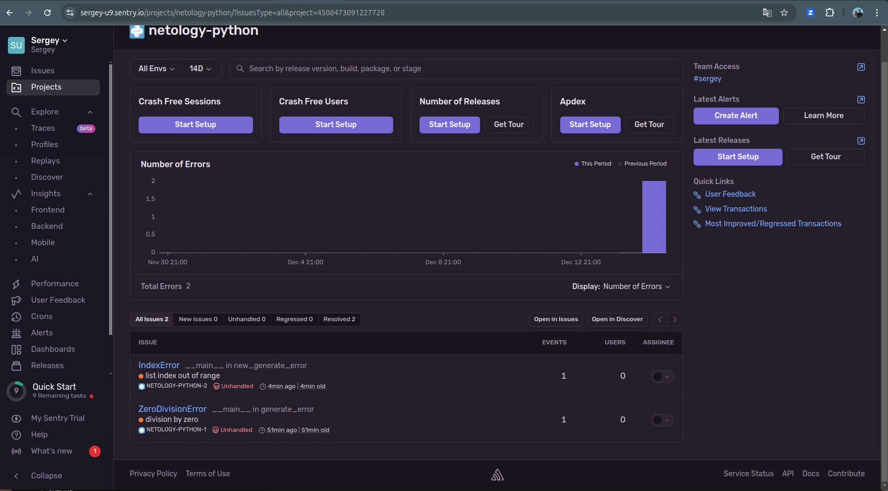
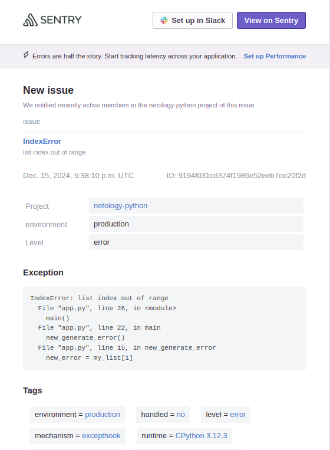
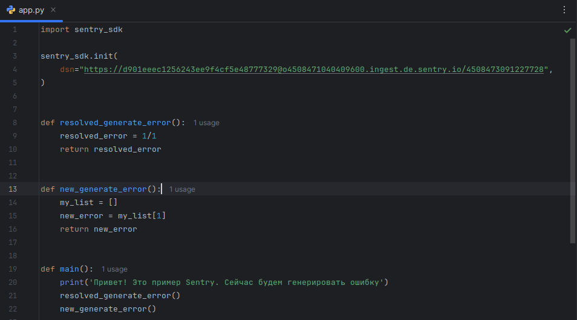

### 1 Регистрация на sentry.io

### 2 Ошибка, сгенерированная из Python поймана sentry:

Создаём новую ошибку и ловим в sentry  

Список событий проекта после нажатия Resolve:  

### 3 Alert на почте:

### Код Python

